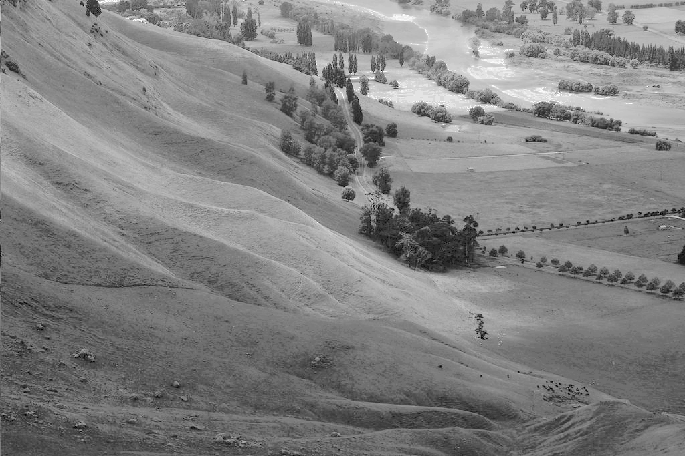
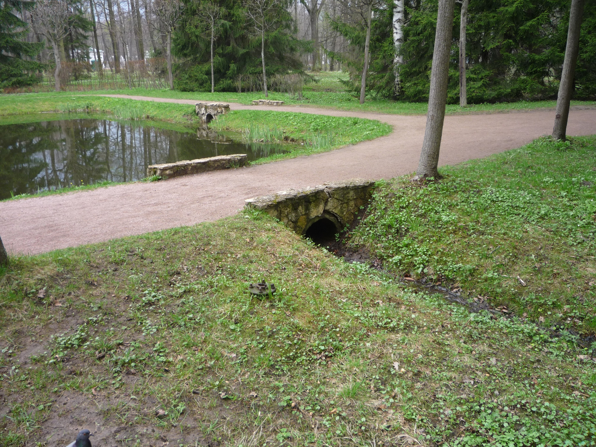

# levnor
Level normalization utility written in Haskell.
## Features
Takes image and transforms luminance to a normal distribution.
Works with grayscale images.

Grayscale input


Grayscale output


Also works with colored images.

Colored input


Colored output


And some distribution parameters work worse than others

Colored output bad


## Requirements
* Stack

## Building
```shell-script
git clone https://github.com/timecatler/levnor.git
cd levnor
stack install
```

Stack binaries location should be on your `PATH` for that to work.

## Usage

`levnor ./path_to_input_image.jpeg ./path_to_output_image.bmp median standart_deviation`